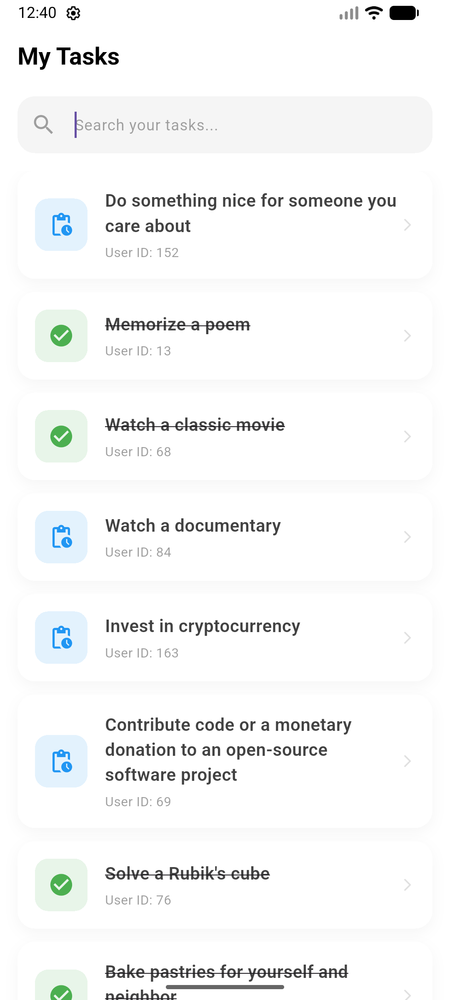
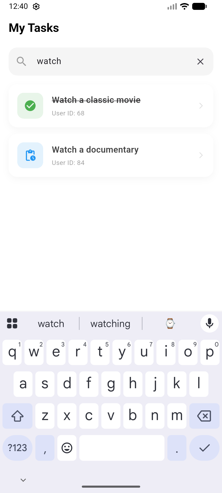
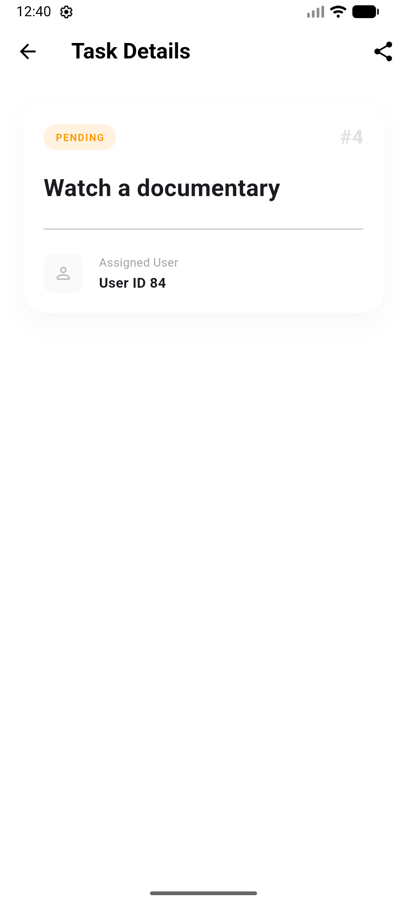

# Simple Bloc Todo App

A modern, simple Todo application built with Flutter using Clean Architecture, BloC state management, and Dio.

## 🚀 Features Checklist

### Core Requirements

- [x] **Use public/free API** (DummyJson)
- [x] **Apply Clean Architecture**
- [x] **Use Dio for API requests**
- [x] **Use BloC for state management**
- [x] **Implement a List Screen to display data**
- [x] **Add Pull to Refresh functionality**
- [x] **Implement Infinite Scroll / Load More**
- [x] **Implement a Search Feature** (Local search with pre-fetching)
- [x] **Properly handle UI states**:
  - [x] Loading
  - [x] Empty
  - [x] Error

### Bonus Features

- [x] **Implement a Detail Screen with Share Content**
- [x] **Use Dependency Injection** (`get_it`)
- [x] **Deeplink handle for open Share Content Link**
  - Scheme: `simplebloc://todo-detail/{id}`
  - Handles both cold and warm starts with a proper navigation stack.

## 📸 Screenshots

| List Screen | Search & States | Detail & Share |
| :---: | :---: | :---: |
|  |  |  |

## 🛠 Tech Stack

- **Framework:** Flutter
- **State Management:** Bloc/Cubit
- **Networking:** Dio
- **DI:** GetIt
- **Routing:** GoRouter
- **Deep Linking:** Native Intent Filters (Android) & URL Types (iOS)

## 🏗 Architecture

The project follows **Clean Architecture** principles:

- **Domain Layer:** Entities, Use Cases, and Repository Interfaces.
- **Data Layer:** Models, Repositories Implementation, and Data Sources.
- **Presentation Layer:** Blocs, Pages, and Widgets.

## 🏁 Getting Started

1. **Clone the repository**
2. **Install dependencies:** `flutter pub get`
3. **Run the app:** `flutter run`

### Testing Deeplinks

You can test the deeplink using terminal:
**Android:**

```bash
adb shell am start -W -a android.intent.action.VIEW -d "simplebloc://todo-detail/1" com.example.simple_bloc_todo_app
```
